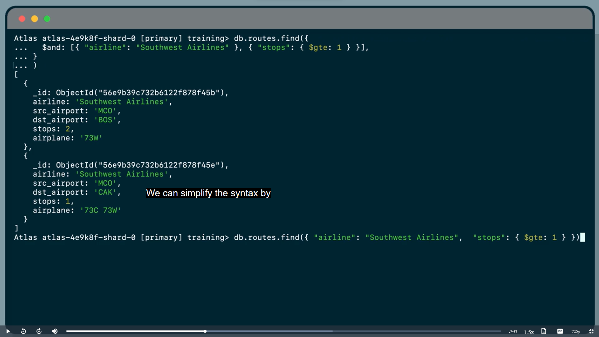
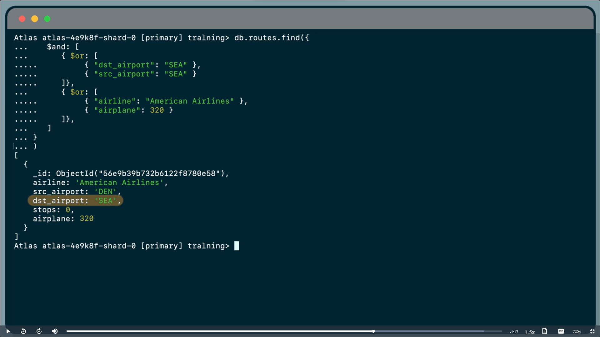
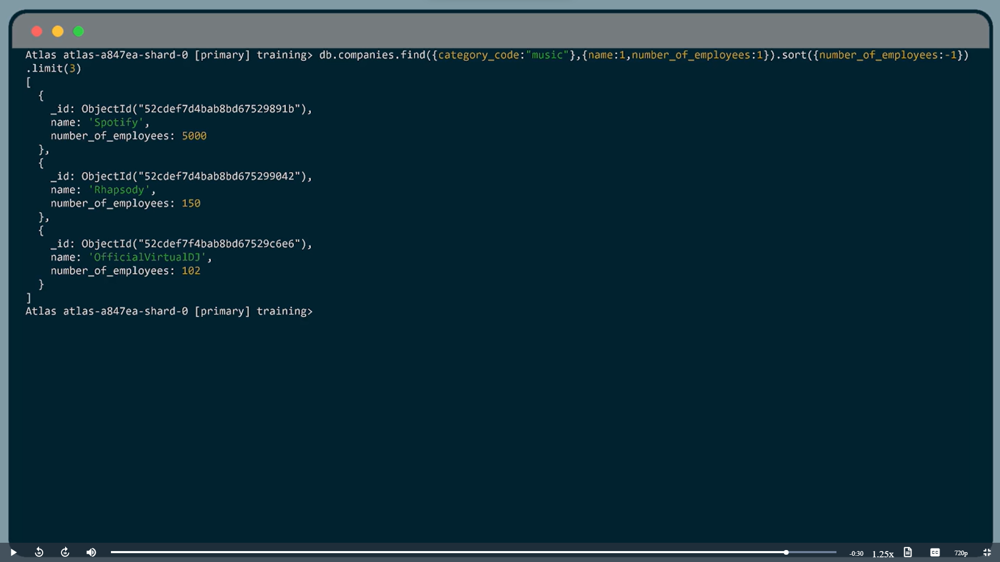
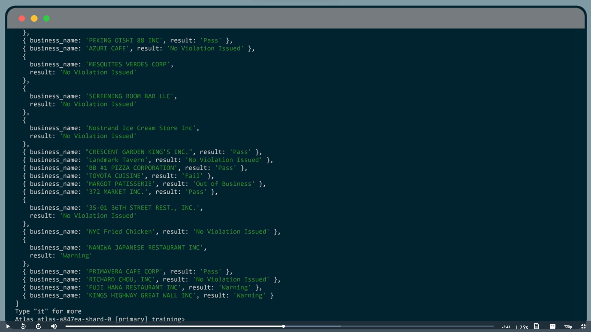
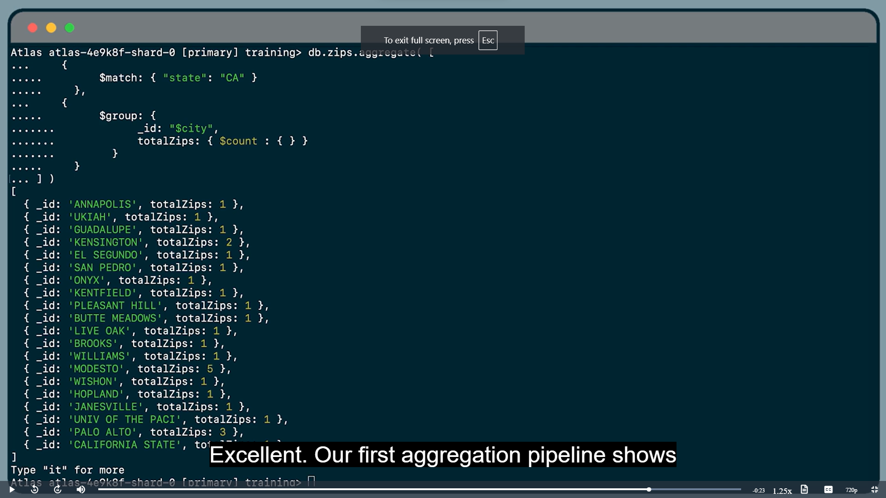
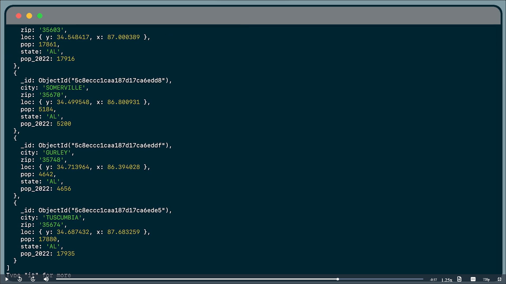
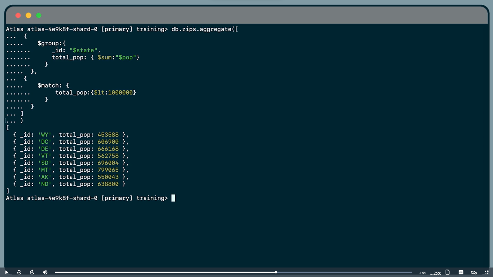
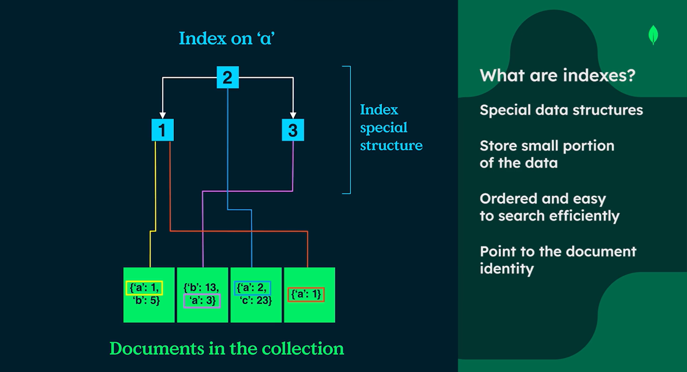

# MongoDB Atlas
- developer data platform
- atlas handles itself
- built-in data replication (replica sets)
- It's a `DBaas` i.e. Database as a service
- stores data on multiple servers
- Ensures data redundancy in case of server failure
***
## Types
- Serverless : 
	- scales on demand
	- charges for resources used
	- used for highly variable workload overtime
	- simple to use
- Clusters : 
	- Shared : 
		- Contains free tier options
		- smaller size
		- good for small projects
	- Dedicated : 
		- customizable
		- enhanced security features
		- scalable
***
- Cloud providers : GoogleCloud, AWS, Azure
- Over 100 geographical regoins
- Change as you scale
- Operational insights
- Backup with point-in-time restore
- Online archive
- Atlas charts for dashboards
- Data API in-built
- GraphQL API
***
***

# MONGODB NOTES
- `<>` indicates - do as mentioned

`Table of Contents`
- [Showing Databases](#showing-databases)
- [Using / Creating Database](#using--creating-database)
- [Showing collections](#showing-collections)
- [Creating Collections](#creating-collection)
- [Inserting Documents](#inserting-documents)
	- [Single Document](#inserting-single-document)
	- [Multiple Documents](#inserting-multiple-documents)
- [Searching in Document](#searching-in-document)
	- [$equ and $in](#equ-and-in)
	- [Comparison Operators](#comparison-operators)
	- [Conditional Operators](#conditional-operators)
- [Replacing Documents](#replacing-a-document)
- [Updating Documents](#updating-a-document)
	- [One Document](#one-document)
	- [Multiple Documents](#multiple-documents)
	- [Find and Modify](#find-and-modify)
- [Deleting Documents](#deleting-a-document)
- [Sorting and Limiting](#sorting-and-limiting-query-results)
	- [Sort Cursor](#sort-cursor)
	- [Limit Cursor](#limit-cursor)
	- [Projections](#projections)
- [Counting Documents](#counting-documents)
- [Aggregation](#aggregation)
	- [Match](#match)
	- [Group](#group)
	- [Sort and Limit](#sort-and-limit)
	- [Project](#project)
	- [Set](#set)
	- [Count](#count)
	- [Out](#out)
- [Indexes](#indexes)

## Showing databases
```bash
show dbs
```

[Return to TOC](#mongodb-notes)

## Using / Creating Database
```bash
use <dbname>
```

[Return to TOC](#mongodb-notes)

## Showing collections
```js
show collections
```

[Return to TOC](#mongodb-notes)

## Creating collection
```js
db.createCollection('<collection name>')
```

[Return to TOC](#mongodb-notes)

***
## Inserting documents
### Inserting single document
- to insert one document use `insertOne()`
```js
db.grades.insertOne( {
	student_id: 123,
	scores: [
		{
			subject: 'Maths',
			marks: 78
		},
		{
			subject: 'Science',
			marks: '89'
		}
	]
} )
```
- there comes a acknowlegment after this with `ObjectId` if not specifies

[Return to TOC](#mongodb-notes)

### Inserting multiple documents
- use `insertMany()`
```js
db.grades.insertMany( {
	student_id: 123,
	scores: [
		{
			subject: 'Maths',
			marks: 78
		},
		{
			subject: 'Science',
			marks: 89
		}
	]
}, {
	student_id: 124,
	scores: [
		{
			subject: 'Maths',
			marks: 58
		},
		{
			subject: 'Science',
			marks: 91
		}
	]
}, {
	student_id: 125,
	scores: [
		{
			subject: 'Maths',
			marks: 23
		},
		{
			subject: 'Science',
			marks: 45
		}
	]
} )
```

[Return to TOC](#mongodb-notes)

***
## Searching in document
### equ and in
- Syntax
```js
db.<collection-name>.find()
```
- Example for `$eq`
```js
db.zips.find({ states: "MH"  })
```
- Example for `$in` for seraching from array
```js
db.zips.find({ city: { $in: ["Pune", "Mumbai"]  }  })
```

[Return to TOC](#mongodb-notes)

### comparison operators
- `$gt` -> greater than
- `$gte` -> greater than equal to
- `$lt` -> less than
- `$lte` -> less than equal to
```js
db.sales.find({ "items.price": { $gt: 50 } })
```
- `items.price` indicate nested fields in document
```js
db.sales.find({ "customer.age": { $gte: 65 } })
```
- `$elemMatch` -> Used to query on array elements
```js
db.accounts.find( {
	products: {
		$elemMatch: { $eq: "InvestmentStock" }
	}
} )
```
```js
db.sales.find( {
	items: {
		$elemMatch: { name: "laptop", price: { $gt: 800 }, quantity: { $gte: 1 } }
	}
} )
```

[Return to TOC](#mongodb-notes)

### conditional operators
- `$and` , `$or` operators


- both mixed



<div style="background-color: red; color: white; font-size: 15px; padding: 10px; border: 2px solid darkred;">
	When including same operator more than once
	in your query, you need to use the explicit $and operator
</div>

[Return to TOC](#mongodb-notes)

***

## Replacing a document
- Syntax : -
	```js
	db.<collection-name>.replaceOne(filter, replacement, options)
	```
- Example : -
	```js
	db.books.replaceOne(
	{ _id: ObjectId("65s863ss4s58s963s24s53") },
	{
		title: "Deep dive in React Hooks",
		ISBN: "0-358-4562-8",
		thumbnail: "http://via.placeholder.com/640x360",
		publicationDate: ISODate("<some date>"),
		authors: ["Ada lovelace"]
	} )
	```
<div style="background-color: red; color: white; font-size: 15px; padding: 10px; border: 2px solid darkred;">
	Beware that replaceOne will replace whole document not append or update it
</div>

[Return to TOC](#mongodb-notes)

***
## Updating a document
### One document
- Syntax : -
	```js
	db.collection.updateOne(
		<filter>,
		<update>,
		{ options }
	)
	```
- `$set` adds new value to document or replaces it if exists
- `$push` appends value to an array or adds array field with specified value if absent
- Example : -

	```js
	db.podcast.updateOne(
		{ _id: ObjectId("8f6y2d9d3ge2ds5sff5wf5wf212") },
		{ $set: { subscribers: 96026 } }
	)
	```
- `upsert` allows to insert document with provided values if one doesn't exists else updates as usual

	```js
	db.podcast.updateOne(
		{ _id: ObjectId("8f6y2d9d3ge2ds5sff5wf5wf212") },
		{ $set: { subscribers: 96026 } }
		{ upsert: true }
	)
	```
- `$push` example

	```js
	db.podcast.updateOne(
		{ _id: ObjectId("6ku9f4s2safd3vsfnthn65d") },
		{ $push: { hosts: "Nic Raboy" } }
	)

	# hosts is an array here
	```

[Return to TOC](#mongodb-notes)

### Multiple documents
- update multiple documents
- accepts `{filter},{update},{options}` as usual
- below command sets all books before 2019 as legacy books status
```js
db.books.updateMany(
	{ publishedDate: { $lt: ISODate("2019-01-01T08:00:00.000Z") } },
	{ $set: { status: "LEGACY" } })
```
- not all-or-nothing operation
- will not roll-back updates
- updates will be visible as soon as they are performed
- not appropriate for some some use cases like business / financial operations

[Return to TOC](#mongodb-notes)

### find and modify
- `findAndModify()` returns the document that just has been updated
- Instead of `updateOne()` then `findOne()` , `findAndModify()` is better as previous takes 2 db calls while latter takes just 1 db call and in previous method another thread may change the document before `findOne()` which is not good
- Example
	```js
	db.podcast.findAndModify(
		query: { _id: ObjectId("8f6y2d9d3ge2ds5sff5wf5wf7854") },
		update: { $inc: { downloads: 1 } },
		new: true
	)
	```

[Return to TOC](#mongodb-notes)

***
## Deleting a document
- accepts `{filter}, {options}`
```js
db.podcasts.deleteOne({ _id: ObjectId("63o696d6f336sa5a33s65s2a3a6x5") })
```
```js
db.podcasts.deleteMany({ category: "crime" })
```

[Return to TOC](#mongodb-notes)

***
## Sorting and limiting query results
### sort cursor
- `cursor` is pointer to result set of query
- `db.collection.find()` returns a pointer to result which is a cursor
- cursor methods are chained to queries using `.` operator by which we can perform sorting and limiting
- Example
	```js
	db.companies.find({ category: "music" }, { name: 1 }).sort({ name: 1 })
	```
- Here `{name: 1}` after category in find is a projection now document returns names only
- IN sort method `1` is used for ascending order and `-1` for descending order
- Capitalized letters are sorted first then lowercase are grouped and sorted (can be changed in options)

[Return to TOC](#mongodb-notes)

### limit cursor
- limiting no. of documents returned as per requirement can enhance query performance
- Example
	```js
	db.companies.find({ category: "music" }, { name: 1, number_of_employees: 1 })
		.sort({ number_of_employees: -1 })
		.limit(3)
	```
- Above example gives names of top 3 music companies with highest no. of employees



[Return to TOC](#mongodb-notes)

### projections
- 	- `1` : include
	- `0` : exclude	
- Example
```js
db.inspection.find({ sector: "Restaurant - 818" }, { name: 1, result: 1, _id: 0 })
```
- Result : -


<div style="background-color: red; color: white; font-size: 15px; padding: 10px; border: 2px solid darkred;">
	Inclusion and exclusion cant be combined in projections with exception of _id field
</div>

[Return to TOC](#mongodb-notes)

***
## Counting documents
- `.countDocuments()` is used to count number of documents
- `<query> and <options>` are accepted
- Example :
	```js
	db.trips.countDocuments()
	>> 10000
	```
	```js
	db.trips.countDocuments({ tripDuration: {$gt: 120}, usertype: "Subscriber" })
	>> 7847
	```

[Return to TOC](#mongodb-notes)

***
## Aggregation
- Used to make multistage queries and create pipelines
- `Aggregation` : An analysis and summary of data
- `Stage` : An aggregation operation performed on the data
- `Aggregation pipeline` : A series of stages completed one at a time, in order
- Data can be `Filtered`, `Sorted`, `Grouped`, `Transformed`
- When a `$` is put before field name it is to refer to it's value
- Order of stages definitely matter
- Syntax : -
	```js
	db.collection.aggregate([
		{ $stage_name: { <expression> } },
		{ $stage_name: { <expression> } }
	])
	```

[Return to TOC](#mongodb-notes)

### match
- `$match` stage is placed mostly early in pipeline (syntax similar to find)
```js
db.zips.aggregate([
	{ $match: { "state": "CA" } }
])
```

[Return to TOC](#mongodb-notes)

### group
- `$group` stage groups document by a group key
- Output is one document for each value of group key
```js
$group: {
	_id: <expression>,
	<field>: { <accumulator>, <expression> }
}
```
- Example



[Return to TOC](#mongodb-notes)

### sort and limit
- `$sort` stage is used to sort the documents as per need
- `$limit` stage limits the no. of documents returned
- `1` for ascending, `-1` for descending
- below code shows 3 zip codes with greatest population
```js
db.zips.aggregate([
	{ $sort: { pop: -1 } }, 
	{ $limit: 3 }
])
```

[Return to TOC](#mongodb-notes)

### project
- `$project` stage used to specifiy what return at last in pipeline
- specify either inclusion or exclusion of fields with exception of `_id` suppresion
- generally used at the last of pipeline
- you can declare new fields too
```js
db.zips.aggregate([
{	
	$project: {
		state: 1,
		zip: 1,
		population: "$pop",
		_id: 0
	}
}
])
```

[Return to TOC](#mongodb-notes)

### set
- `$set` stage adds or modifies fields in the pipeline
- useful when want to change existing fields in pipeline or add new ones to be used in upcoming	pipeline stages
```js
db.zips.aggregate([
{ $set: { 
		pop_2022: { 
			$round: { $multiply: [1.0031, "$pop"] } 
		} 
	} 
}
])
```


[Return to TOC](#mongodb-notes)

### count
- `$count` stage counts no. of documents in pipeline 
- it returns the total document count
- `$count: <field-name>`
```js
db.zips.aggregate([
	{ $count: "total_zips" }
])
```
```js
>> [ { total_zips: 29367 } ]
```

[Return to TOC](#mongodb-notes)

### out
- `$out` stage writes the documents that are returned by an aggregation pipeline into a collection
- It `must` be a last stage 
- Creates a new collection if doesn't exist
- If exists `$out` replaces the existing collection with new data
- Syntax : -
```js
$out: {
	db: "<db>",
	coll: "<new collection>"
}
// or
$out: "<new collection>" // for same database
```
- Example
```js
db.zips.aggregate([
{
	$group: {
		_id: "$state",
		total_pop: { $sum: "$pop" }
	}
}, {
	$match: {
		total_pop: { $lt: 1000000 }
	}
}, {
	$out: "small_states"
}
])
````
- above query writes all the result to collection names `small_states` in same database


<div style="background-color: red; color: white; font-size: 15px; padding: 10px; border: 2px solid darkred;">
	Double check to be sure that new collection name doesn't match an existing one unless you want to explicitly override the data else data goes brrr...
</div>

[Return to TOC](#mongodb-notes)

***
## Indexes
- They are used background of databases to speed up querying


- Indexes improve query performance
	- Speed up queries
	- Reduce disk I/O
	- Reduce resources required
	- Support equality matches and range-based operations and returns sorted results
- Without indexes
	- MongoDB reads all documents (collection scan)
	- Sorts results in memory (if required)
- With indexes
	- MongoDB only fetches the document identified by the index based on the query
	- Returns results faster
- There is one default index per collection, which includes only the `_id` field
- Every query should use an index
- If we insert or update documents, we need to update the index Data Structure
- Delete unnecessary or redundant indexes
### Single field Index
- Index on single field
- Support queries and sort on single field
```js
db.collection.createIndex({ fieldname: 1 })
```
```js
db.collection.getIndexes()
// to get the indexes created
```
```js
db.custormers.explain().find({ birthdate: { $gt: ISODate("1995-08-01") } }).sort({ email: 1 })
// .explain() used to get if any indexes used in this query
```